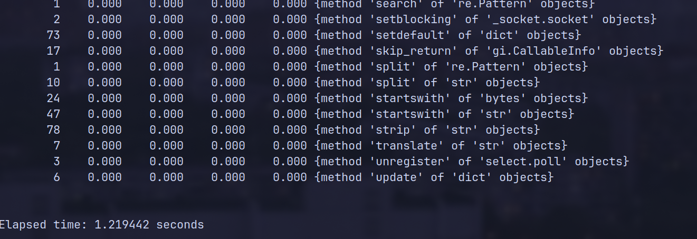
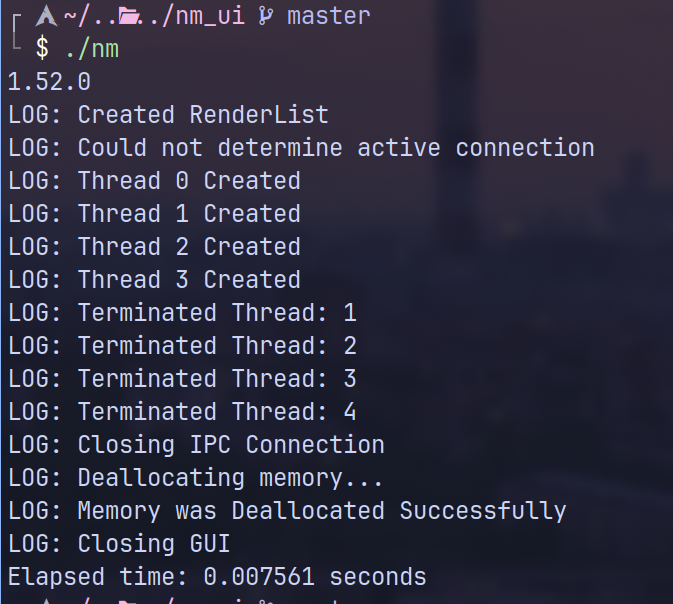

## Benchmarks 
## Without render overhead
#### Done using  with 3 warmup runs and 100 tests , using hardcoded input </br>

### Python3  </br>

 Mean [ms]   | Min [ms] | Max [ms] | Relative |</br>
 191.5 ± 3.5 | 182.5 | 199.4 | 1.00 |</br></br>
### C </br>
 Mean [ms] | Min [ms] | Max [ms] | Relative |</br>
| 11.3 ± 1.0 | 9.7 | 14.7 | 1.00 | </br></br>

## With Render Overhead
#### Done using inbuilt timing methods (c profiling for consistency)</br>

### Python3

**Elapsed time:** `1.219442` seconds  

#### Python code used for profiling:
```python
profiler = cProfile.Profile()
profiler.enable()

main()

profiler.disable()
end = time.time()
print("Main finished")

profiler.print_stats()
print(f"Elapsed time: {end - start:.6f} seconds")
```
#### Assets

</br> </br>
### C (With Render Overhead)
**Elapsed time:** `0.007561` seconds

```c
int main() {
    clock_t start_time, end_time;

    start_time = clock();

    StartEventLoop();

    Terminate(global_ctx);

    end_time = clock();

    double elapsed_time = (double)(end_time - start_time) / CLOCKS_PER_SEC;

    printf("Elapsed time: %f seconds\n", elapsed_time);

    return 0;
}

```

#### Assets

</br> </br>

## Usage

The project is beta backend to [!(network_manager_ui)[https://github.com/Blazzzeee/network_manager_ui]](https://github.com/Blazzzeee/network_manager_ui) written in C , to achieve blazing fast speed and has overall better design philosophy as well as system design from the previous version , and avoids a lot of annoying bugs in the previous version

Install network_manager_ui as stated in the original repo, and use make after cloning this repo

Dependencies :- make, Network_manager_ui, pkg-config, libnm(shipped with NetworkMangeer on arch) or use libnm-dev in debian /fedora
